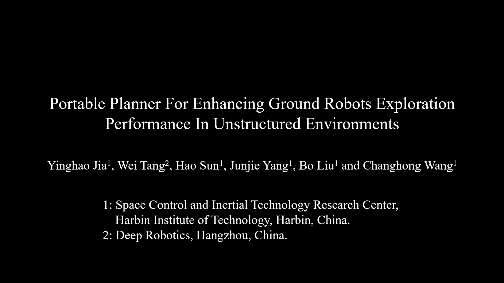

# pplanner
This is a portable planner for ground robots.

Notably, the codes of this work is cumbersome and no longer maintained as our attention is paied to improve the efficiency by another algorithms which is coming soon.
## Dependencies
These instructions assume that ROS desktop-full of the appropriate ROS distro is installed.

Install necessary libraries:

- [grid_map](https://github.com/ANYbotics/grid_map) (grid map library for mobile robots)
```bash
sudo apt-get install ros-noetic-grid-map-core ros-noetic-grid-map-msgs
```
- [elevation_mapping_cupy](https://github.com/YinghaoJia98/elevation_mapping_cupy.git) The test_carved_stair branch is used in my experiment and the original [elevation_mapping_cupy](https://github.com/leggedrobotics/elevation_mapping_cupy.git) also can be used.
- [pplanner_msgs](https://github.com/YinghaoJia98/pplanner_msgs.git) The msg and srv files which would be in cluded into this pack in the future.
- [pplanner_ui](https://github.com/YinghaoJia98/pplanner_ui.git) The ui files which would be in cluded into this pack in the future.

## Build
```bash
mkdir -p pplanner_ws/src/
git clone git@github.com:YinghaoJia98/pplanner.git
catkin build -DCMAKE_BUILD_TYPE=Release
```

## Run

### Simulation
Intstall the simulator
- [pplanner_simulator](https://github.com/YinghaoJia98/pplanner_simulator.git)


Run the demo
```bash
cd pplanner_ws
catkin build -DCMAKE_BUILD_TYPE=Release
source devel/setup.bash
roslaunch pplanner_simulator PplannerSmbCeshi2ForPplanner.launch
roslaunch pplanner pplanner_simulator.launch
```

### Parameters
The config file is [pplanner_settings_simulator.yaml](/config/pplanner_settings_simulator.yaml). 

The subscribed topics for mapping:
* grid_map_topic
* elevation_layer
* traversability_layer
* traversability_supplementary_layer
* world_frame
* track_frame

The subscribed topics for tracker:
* World_Frame
* Robot_Frame

The published topics:
* cmd_topic_


## Experiments Videos
[](https://youtu.be/mDWgfCYdEO8?si=YKW1rS3wECr85p9L)

## Thanks
The robots used in simulator is reorganized from [GBP](https://github.com/ntnu-arl/gbplanner_ros.git).
Benifiting from the robotics community and we choose to make our work public.

## Contact us
* [Yinghao Jia](mailto:yinghaojia@163.com)
* Wei Tang
